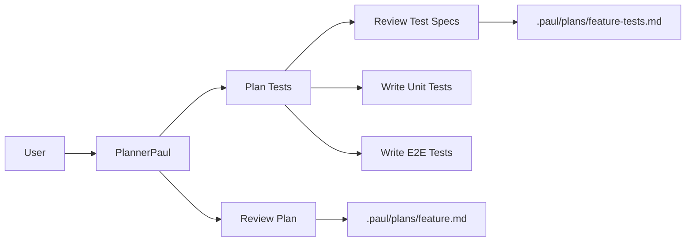
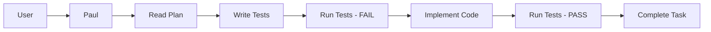
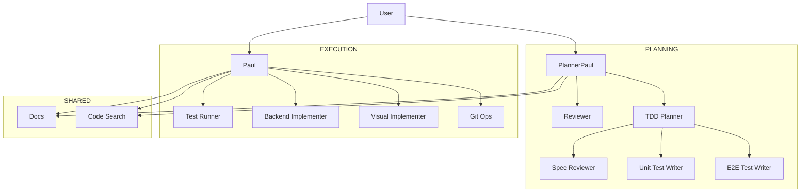

# Oh My Lord OpenCode - Canonical Workforce Documentation

> Last Updated: 2026-01-20

## 📋 Project Overview

**Oh My Lord OpenCode** is a TDD-first fork of [oh-my-opencode](https://github.com/jaino-song/oh-my-lord-opencode) with mandatory Test-Driven Development workflow and biblical agent naming.

- **Version**: 3.0.0-beta.8
- **License**: SUL-1.0
- **Repository**: https://github.com/jaino-song/oh-my-lord-opencode
- **Package Manager**: Bun (only - npm/yarn/pnpm blocked)
- **TypeScript**: 5.7.3+ (strict mode)

### Key Differentiator

**Code cannot be written without tests being planned first.** This is enforced at the hook level, not just suggested.

---

## 🏗️ Directory Structure

```
oh-my-lord-opencode/
├── 📂 src/                      # Main source code
│   ├── 🤖 agents/               # AI Agents (11+ specialized agents)
│   ├── 🪝 hooks/                # Lifecycle hooks (30+ hooks)
│   ├── 🛠️  tools/               # LSP, AST-Grep, delegation tools
│   ├── ⚙️  features/            # Core features & integrations
│   ├── 🤝 shared/               # Cross-cutting utilities
│   ├── 💻 cli/                  # CLI installer & doctor checks
│   ├── 🔌 mcp/                  # Built-in MCP servers
│   ├── 📝 config/               # Zod schemas & validation
│   └── 📄 index.ts              # Main plugin entry point
│
├── 📂 docs/                     # Documentation
│   ├── OH_MY_LORD_ARCHITECTURE.md
│   ├── orchestration-guide.md
│   ├── agent-architecture.yaml
│   └── cli-guide.md
│
├── 📂 .paul/                    # Planning artifacts
│   ├── plans/                   # Implementation plans
│   └── drafts/                  # Draft documents
│
├── 📂 .sisyphus/                # Execution state
│   └── approval_state.json      # Test approval tracking
│
├── 📂 packages/                 # Platform-specific binaries
│   ├── darwin-arm64/
│   ├── darwin-x64/
│   ├── linux-arm64/
│   ├── linux-x64/
│   └── windows-x64/
│
├── 📂 script/                   # Build scripts
│   ├── build-schema.ts
│   ├── build-binaries.ts
│   └── publish.ts
│
├── 📂 dist/                     # Build output (ESM + .d.ts)
├── 📂 bin/                      # CLI executables
└── 📄 package.json              # Project manifest
```

---

## 🤖 Agents (Biblical Workforce)

### Orchestration Layer
| Agent | Biblical Role | Responsibility | Can Call |
|-------|--------------|----------------|----------|
| **Paul** | Master Orchestrator | Delegates everything, writes nothing | Joshua, Sisyphus-Junior, Git-Master, Frontend-UI |
| **planner-paul** | Implementation Planner | Requirements gathering, architecture planning | Timothy, Solomon, Nathan, Librarian, Explore |

### Planning Specialists
| Agent | Biblical Role | Responsibility | Called By |
|-------|--------------|----------------|-----------|
| **Solomon** | TDD Planner | Plans tests BEFORE implementation | planner-paul |
| **Timothy** | Plan Reviewer | Reviews implementation plans | planner-paul |
| **Thomas** | TDD Spec Reviewer | "Doubting Thomas" - verifies test specs | Solomon |
| **Nathan** | Code Analyzer | Analyzes existing code patterns | planner-paul, Paul |

### Test Writers
| Agent | Biblical Role | Responsibility | Called By |
|-------|--------------|----------------|-----------|
| **Peter** | Unit Test Writer | Writes Jest unit tests | Solomon, Paul |
| **John** | E2E Test Writer | Writes Playwright E2E tests | Solomon, Paul |

### Execution Specialists
| Agent | Biblical Role | Responsibility | Called By |
|-------|--------------|----------------|-----------|
| **Joshua** | Test Runner | Executes Jest & Playwright tests | Paul |
| **Sisyphus-Junior** | Backend Implementer | NestJS/TypeScript implementation | Paul |
| **frontend-ui-ux-engineer** | Frontend Specialist | Next.js/React/Tailwind UI | Paul |
| **Git-Master** | Git Operations | Commits, branches, merges | Paul |

### Shared Resources
| Agent | Role | Responsibility | Called By |
|-------|------|----------------|-----------|
| **Librarian** | Documentation Expert | Fetches official docs via Context7 | planner-paul, Paul |
| **Explore** | Code Search | Fast codebase exploration | planner-paul, Paul |
| **Oracle** | General Q&A | Answers questions | Any |

---

## 🪝 Hooks (30+ Enforcement Mechanisms)

### Critical Hooks

#### 1. `sisyphus-orchestrator` (The "No Code" Hook)
- **Target**: Paul, planner-paul
- **Action**: Intercepts `Write`/`Edit` tools
- **Logic**: Blocks file writes outside `.sisyphus/` or `.paul/`
- **Impact**: Paul literally cannot write production code - must delegate

#### 2. `hierarchy-enforcer` (The "Council" Hook)
- **Feature 1**: Call Graph - Enforces parent-child whitelist
- **Feature 2**: Competency Traps - Routes tasks to specialists
  - Visual/UI keywords → `frontend-ui-ux-engineer`
  - Git keywords → `git-master`
  - Docs keywords → `librarian`
- **Feature 3**: Approval Gates - Requires test approval before completion
- **Feature 4**: TDD Warning - Warns if implementation without recent tests

#### 3. `tdd-enforcement` (The "Test Gate")
- Blocks task completion without test approval
- Tracks test runs in `.sisyphus/approval_state.json`
- Enforces Red-Green-Refactor cycle

#### 4. `strict-workflow` (The "Environment" Hook)
- **Bun Only**: Blocks npm/yarn/pnpm
- **Commit Style**: Enforces Conventional Commits
- **Naming**: Enforces kebab-case filenames

### Hook Categories

```
src/hooks/
├── 🔒 Enforcement Hooks (12)
│   ├── hierarchy-enforcer/         # Call graph & competency routing
│   ├── tdd-enforcement/            # Test approval system
│   ├── orchestrator-delegate-only/ # Blocks Paul from coding
│   ├── strict-workflow/            # Environment restrictions
│   ├── parallel-safety-enforcer/   # Prevents race conditions
│   └── ...
│
├── 📝 Context Injection (8)
│   ├── directory-agents-injector/  # Auto-inject AGENTS.md
│   ├── directory-readme-injector/  # Auto-inject README.md
│   ├── rules-injector/             # Inject project rules
│   └── ...
│
├── 🛠️ Developer Experience (6)
│   ├── auto-slash-command/         # /commit, /test shortcuts
│   ├── background-notification/    # Background task alerts
│   ├── task-resume-info/           # Resume interrupted tasks
│   └── ...
│
└── 🔧 System Utilities (4)
    ├── session-recovery/           # Crash recovery
    ├── context-window-monitor/     # Token usage tracking
    └── ...
```

---

## ⚙️ Features

```
src/features/
├── claude-code-plugin-loader/      # Load OpenCode plugins
├── claude-code-agent-loader/       # Register custom agents
├── claude-code-command-loader/     # Load slash commands
├── opencode-skill-loader/          # Load skills
├── claude-code-mcp-loader/         # MCP server integration
├── background-agent/               # Parallel agent execution
├── boulder-state/                  # State persistence
├── task-toast-manager/             # Task notifications
├── builtin-commands/               # Core commands (/commit, /test)
└── builtin-skills/                 # Core skills
```

---

## 🛠️ Tools

```
src/tools/
├── lsp/                            # Language Server Protocol tools (11)
│   ├── hover/                      # Get symbol information
│   ├── definition/                 # Go to definition
│   ├── references/                 # Find references
│   ├── rename/                     # Rename symbol
│   └── ...
│
├── ast-grep/                       # AST-based code search
├── delegate-task/                  # Agent delegation
├── session-manager/                # Session state management
└── ...
```

---

## 🏛️ Architecture Philosophy

### The Three Pillars of Enforcement

1. **Code-Level Blocking (The Law)**
   - Hooks throw `Error` to reject invalid actions
   - Physical prevention, not polite requests

2. **Prompt-Level Directives (The Instructions)**
   - Minimalist prompts for token efficiency
   - Clear, concise system messages

3. **Context Injection (The Knowledge)**
   - Auto-inject `AGENTS.md` and `README.md`
   - On-demand context loading

### Zero-Trust Orchestration

> "We assume the LLM will be lazy, hallucinate, and cut corners. Therefore, we do not *ask* it to follow rules; we **physically prevent** it from breaking them."

---

## 🔄 Workflow (Enforced Sequence)

### Phase 1: Planning (The Architect)


1. User calls `@planner-paul`
2. Planner analyzes request and drafts plan
3. **Review**: Planner MUST call `Timothy` to review
4. **TDD Prep**: Planner calls `Solomon` for test specs
5. **Output**: Plan files in `.paul/plans/`
6. **Handover**: User switches to `@Paul`

### Phase 2: Execution (The Builder)


**TDD Loop (Red-Green-Refactor):**
1. **RED**: Paul calls Peter/John to write tests
2. **RUN**: Paul calls Joshua → Result: **FAIL**
3. **GREEN**: Paul calls Sisyphus-Junior to implement
4. **VERIFY**: Paul calls Joshua → Result: **PASS**
5. **COMPLETE**: Paul marks task done (only if tests pass)

---

## 🎯 Operating Modes

| Feature | Strict Mode (Plan Exists) | Fast Mode (No Plan) |
|---------|--------------------------|---------------------|
| **Planning** | Done by planner-paul | Done by Paul |
| **Review** | Timothy & Thomas required | Skipped |
| **Hierarchy** | Strict | Relaxed |
| **TDD** | **ENFORCED** (warning if skipped) | **ENFORCED** (warning if skipped) |
| **No Coding** | **ENFORCED** (blocked) | **ENFORCED** (blocked) |
| **Competency** | **ENFORCED** (traps active) | **ENFORCED** (traps active) |

**Use Case:**
- **Strict Mode**: New features, major refactors
- **Fast Mode**: Quick bugfixes, minor tweaks

---

## 📊 Data Structures

### Approval State (`.sisyphus/approval_state.json`)
```json
{
  "approvals": [
    {
      "taskId": "call_12345",
      "approver": "Joshua",
      "timestamp": 1700000000,
      "status": "approved"
    }
  ]
}
```

### Plans (`.paul/plans/`)
- `{feature}.md` - Implementation plan
- `{feature}-tests.md` - Test specifications

---

## 🔧 Tech Stack

### Development
- **Runtime**: Bun (only)
- **Language**: TypeScript 5.7.3+ (strict mode)
- **Module**: ESM only
- **Validation**: Zod schemas
- **Testing**: Bun test (84 test files)

### Key Dependencies
```json
{
  "@ast-grep/napi": "^0.40.0",
  "@opencode-ai/plugin": "^1.1.19",
  "@opencode-ai/sdk": "^1.1.19",
  "@modelcontextprotocol/sdk": "^1.25.1",
  "zod": "^4.1.8"
}
```

### Built-in MCP Servers
- **context7**: Official documentation lookup
- **websearch**: Web search integration
- **grep_app**: Advanced code search

---

## 🚀 Quick Commands

```bash
# Installation
bun install                      # Install dependencies (bun only!)

# Development
bun run typecheck               # Type check only
bun run build                   # ESM + declarations + schema
bun test                        # Run all tests (84 test files)
bun test <pattern>              # Run specific test
bun test --watch                # Watch mode

# Build Variants
bun run build:all               # Build + binaries for all platforms
bun run build:binaries          # Build platform-specific binaries
bun run build:schema            # Generate JSON schema
```

---

## 📖 Documentation Map

| Document | Purpose |
|----------|---------|
| `README.md` | Project overview, agent changes, philosophy |
| `AGENTS.md` | Complete agent documentation (auto-injected) |
| `docs/OH_MY_LORD_ARCHITECTURE.md` | System architecture, hooks, workflow |
| `docs/orchestration-guide.md` | How to use the orchestration system |
| `docs/agent-architecture.yaml` | Agent hierarchy & call graph |
| `docs/cli-guide.md` | CLI usage & commands |

---

## 🔍 Code Style

### TypeScript
- **Strict mode**: All strict compiler options enabled
- **Types**: Use `bun-types` (NOT @types/node)
- **Imports**: Named exports preferred, avoid default exports
- **Optional props**: Use `?` extensively
- **Dynamic objects**: `Record<string, unknown>`

### Naming Conventions
- **Directories**: kebab-case (`directory-agents-injector/`)
- **Factories**: `createXXXHook()`, `createXXXTool()`
- **Files**: kebab-case, co-located tests (`*.test.ts`)
- **Types**: PascalCase interfaces, `Schema` suffix for Zod

### Error Handling
- Consistent `try/catch` with `async/await`
- Graceful degradation in hooks
- Debug logging via `process.env.*_DEBUG === "1"`

---

## 🎭 Agent Call Graph (Enforced)



**Violation Example:**
```
planner-paul → Sisyphus-Junior
❌ BLOCKED: "HIERARCHY VIOLATION: Agent 'planner-paul' is not authorized to call 'Sisyphus-Junior'."
```

---

## 🏆 Key Achievements

1. **84 Test Files** - Comprehensive test coverage
2. **30+ Hooks** - Extensive enforcement system
3. **11+ Agents** - Specialized workforce
4. **11 LSP Tools** - Advanced code intelligence
5. **3 Built-in MCPs** - Context7, WebSearch, GrepApp
6. **Zero Default Exports** - Clean module structure
7. **Strict TypeScript** - Maximum type safety
8. **Bun-First** - Modern runtime & package manager

---

## 🔒 Forbidden Practices

**The plugin actively blocks:**
- ❌ npm/yarn/pnpm commands (Bun only)
- ❌ Direct code writing by Paul/planner-paul
- ❌ Task completion without test approval
- ❌ Unauthorized agent calls (hierarchy violations)
- ❌ Non-conventional commit messages
- ❌ Non-kebab-case filenames

---

## 📝 Contributing

See `CONTRIBUTING.md` for:
- Development setup
- Testing guidelines
- PR requirements
- CLA signing

---

## 📄 License

**SUL-1.0** (Shared Use License)

---

## 🔗 Links

- **Repository**: https://github.com/jaino-song/oh-my-lord-opencode
- **Issues**: https://github.com/jaino-song/oh-my-lord-opencode/issues
- **Original Fork**: https://github.com/jaino-song/oh-my-lord-opencode

---

*Generated from codebase analysis on 2026-01-20*
